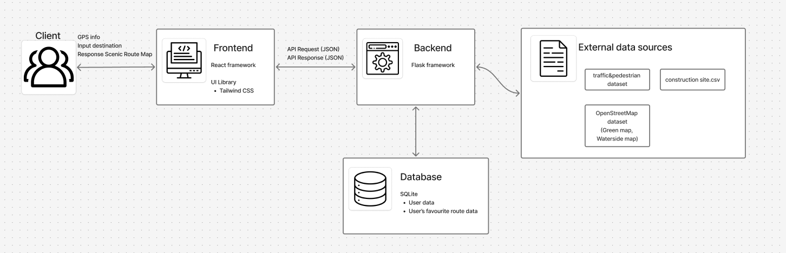
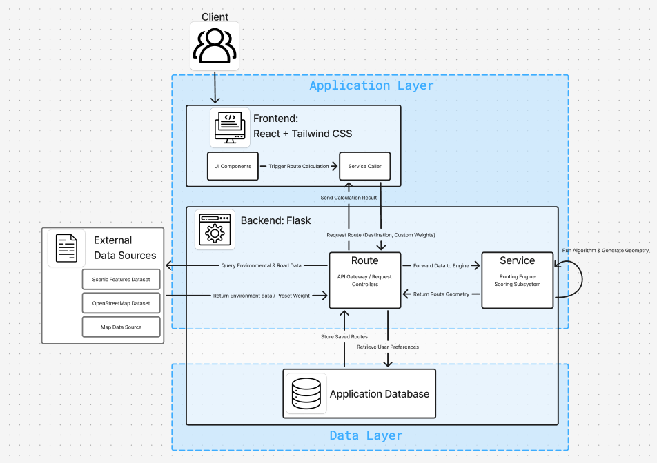

We selected a lightweight, highly compatible, and production-ready technology stack. The primary goal of this architecture is to minimize implementation complexity while maximizing development velocity.

# Technology Stack

## Frontend: React
We adopted React for building the user interface.

**Reason for Selection:** 
The system requires a highly interactive, responsive map interface that handles real-time visual updates, such as switching environmental data overlays (heatmaps/markers) and dynamically displaying route comparisons. React’s component-based architecture and virtual DOM ensure efficient rendering of these frequent state changes without performance degradation. Furthermore, its mature ecosystem provides seamless integration with map rendering libraries (e.g., Leaflet or Mapbox GL) and accessible UI frameworks (e.g., Tailwind CSS), allowing us to efficiently fulfill the strict usability and contrast ratio standards (NFR-11) required for both desktop and mobile viewports.

## Backend: Flask (Python)
For the core logic and routing services, we selected Flask, a micro-framework for Python.

**Reason for Selection:** 
The core of the Scenic Navigation System relies on a custom multi-objective pathfinding algorithm that processes geographic data from OpenStreetMap alongside diverse environmental datasets (vehicular traffic, pedestrian traffic, location of scenic features). Python is the industry standard for geospatial data processing and mathematical analysis, offering robust libraries such as NetworkX, GeoPandas, and Shapely. Flask was selected as the backend framework because its minimalist, unopinionated, and lightweight design allows us to easily decouple the routing engine from the API layer. This perfectly aligns with our architectural requirement for a modular system (NFR-12), enabling independent updates to routing parameters and algorithms without introducing unnecessary framework overhead.

## Database: SQLite
We selected SQLite as our relational database management system (RDBMS) to handle user authentication and saved routes.

**Reason for Selection:** 
As a serverless, self-contained, single-file database system, SQLite eliminates the operational overhead of hosting, configuring, and maintaining an independent database server during the prototyping phase. Since the prototype's primary data storage is restricted to structured, user-specific data—such as user credentials, recent history, and saved scenic routes—SQLite provides a highly reliable, zero-configuration RDBMS that satisfies our data persistence needs. Its lightweight nature minimizes system complexity, allowing the infrastructure to remain tightly focused on the core computational tasks of multi-objective route generation.

# System Architecture Operation

This diagram illustrates the runtime behavior and dynamic data flow during a typical user path-generation request.

## Request Initiation
The user interacts with the Frontend (built with React + Tailwind CSS). When the user selects a destination and customizes the scenic weights, the route calculation will be triggered, inputs will be forwarded to the API service caller component.
The frontend API transmits a request carrying the payload (destination coordinate data and personalized scenic weights) to the Backend Route layer (Flask Controller). This component acts as the central controller for the runtime operation. 
By decoupling the user interface (Frontend) from the business logic (Backend Route), the client side remains lightweight and focused purely on rendering, which optimizes browser-side performance and allows independent scalability. This provides instantaneous feedback for users to maintain the access on interactive, responsive map interface, adjusting a scenic weight instantly translates to visual changes without interface latency.

## Data Fetching
The Route Request Controller queries the External Data source such as OpenStreetMap to fetch the necessary spatial and environmental context, and requests System Dataset for the user statistics and preferences. 
Backend Route layer serves as a centralized controller, ensuring all user requests are validated, authorized, and structured consistently before entering the computational layers, minimizing security risks and request overhead.
The external data sourcing ensures the software remains highly lightweight and cost-effective to host, requiring minimal local database storage, while still providing rich, up-to-date real-world context for its routing features.

## Core Computation & Routing
After the map data and user configurations are collected, the Backend Controller forwards the essential data to the Backend Service layer (Routing Engine).
Isolating computational tasks to the Backend Service layer prevents the main web controller from issues during long-term calculations, ensuring the server remains responsive to other active users.
The Routing Engine executes parallel environmental scoring (processing green spaces, water bodies, etc.) and runs the customized search algorithm within the Scoring Subsystem to compute the optimal scenic paths based on the weights.
Processing multiple environmental factors (green space, water body proximity) parallely maximizes CPU utilization and accelerates edge-weight calculation times. By routing requests through a lightweight Flask Controller, and delegating the heavy math to a dedicated Routing Engine, the system prevents the web server from crashing. Therefore, the main application remains responsive and capable of handling other user requests, with spatial optimization conducted in the background.

## Result Delivery
After the route computation finishes, the Backend Service component generates a standardized spatial vector data package. This result is returned to the Route controller, which sends it back to the client side. The Frontend receives this response and dynamically renders the optimized scenic path geometry directly onto the map interface for the user.
